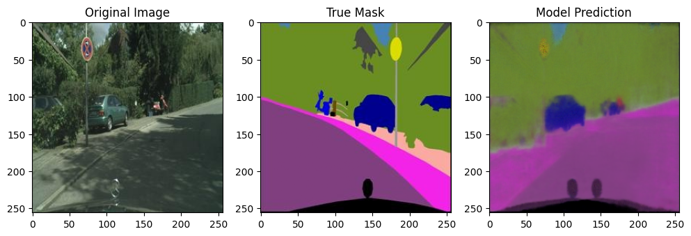
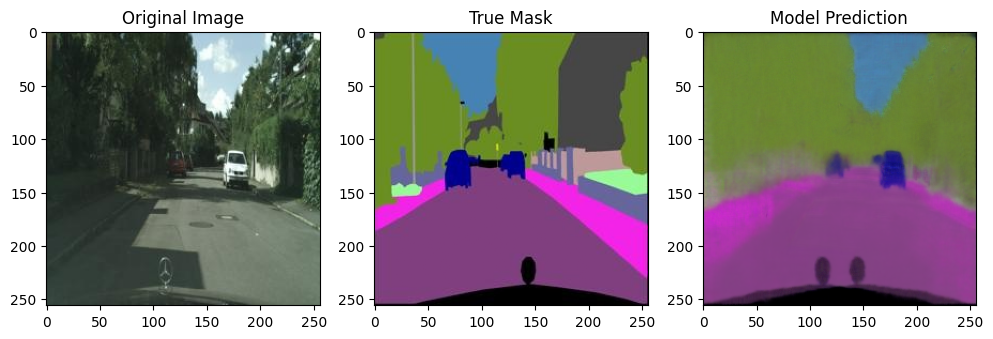
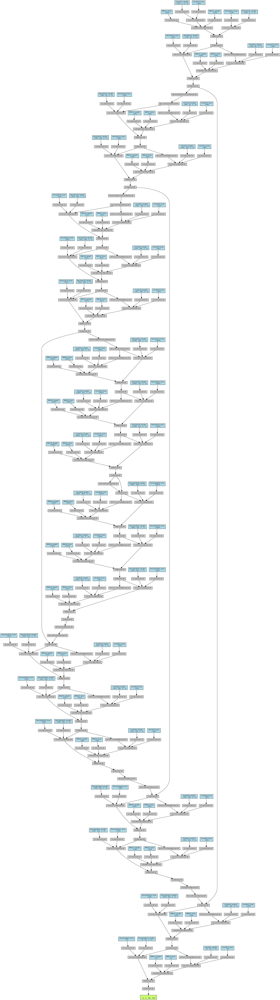

# Res-UNet cityscape

## Model architecture
- This model is based on res-UNet architecture with 3 pooling and 2~3 layers.

## Res-UNet
- The res UNet which is residual U-Net for image segmentation.
- The Normal UNet is unified encoder and decoder (especially encoder connected decoder) based on the SegNet architecture.
- I found with only UNet architecture, one of RGB data prone to disappear while in decoding process for 3-4 times pooling process.
- The residual model add the original data after hidden layer process, so it can prevent gradient disappear.

## Regulation, loss function, and Optimization
  1. Dropout in model.
  2. Batch norm in model.
  3. Horizontal flip in train data.
  4. SmoothL1Loss for loss function.
  5. GLU in activation.
  6. ADAM for optimizer.

The training process and monitoring are worked in google colab, and it doesn't allow to add all processed jupyter image logs in gitHub.
For more information DM to LinkedIn - linkedin.com/in/shawn-kim-65a1aa1a2
or eMail to shawnkim1232@gmail.com

## Example of model results

## Architecture of the Res-UNet

